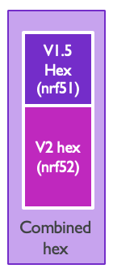

# 🍔 micro:bit Fat Binaries

Specification version 0.3.0.

## Goal

The goal of a micro:bit fat binaries is to be able to create a single file-format that can be flashed into a micro:bit v1 and a micro:bit v2 successfully.

## Definitions and Rationale

A fat binary is a file containing binary code for multiple CPU architectures.

The microcontroller used in the micro:bit v2 (nRF52) is different than the microcontroller used in micro:bit v1 (nRF51), with a different architecture (Arm Cortex M0+ vs Cortex M4), slightly different peripherals, and different hardware components on the board.

The micro:bit v1 and v2 boards use an interface chip, with the DAPLink firmware to flash the target microcontroller. DAPLink is responsible for processing the files dropped into the micro:bit MSD and any new file format would be implemented in that project.

To easily support our users, we want the online editors to generate a single file that will work in both micro:bit v1 and micro:bit v2.

Therefore, a micro:bit fat binary is a file that contains the binary data for both micro:bit v1 and micro:bit v2, in a format that the DAPLink can process to only write to memory the data relevant to its micro:bit board.

While the nature of the v1.5 hex file is fixed by the requirements of the existing deployed firmware, the nature of the v2 firmware is flexible.

## Requirements

- shall: mandatory feature
- should: desired feature

1. The fat-binary file shall flash correctly in a micro:bit v2 with any version of DAPLink shipped after P2 prototypes
2. The fat-binary file shall flash correctly on a micro:bit v1 with DAPLink v0241 or newer
3. The fat-binary file should flash correctly on a micro:bit v1 with DAPLink v0234
4. The fat-binary file flash time should be similar (+/- 10%) than the same microbit-v1-only hex file
5. The micro:bit v2 DAPLink interface shall also consume ‘standard’ hex and bin files for micro:bit v2 (eg produced by Mbed or other tools)

## DAPLink Interface Versions Shipped

- 0234: Version shipped in the original BBC drop, over 800K units with this version
- 0241: Version shipped in the v1.3B retail version
- 0249: Version shipped in micro:bit v1.5
- 0254: Latest version at the time of writing
